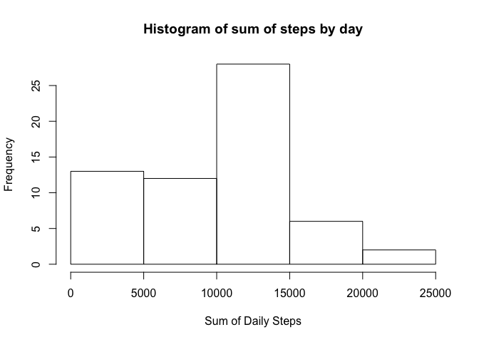
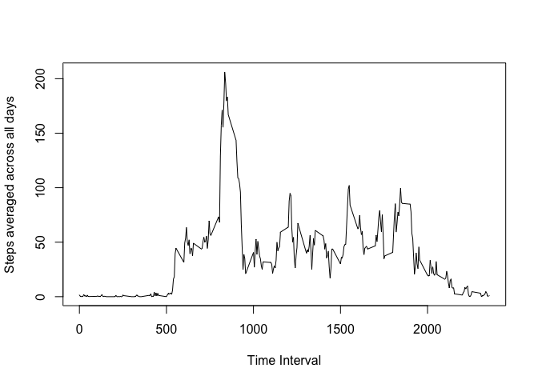

# Reproducible Research: Peer Assessment 1


## Loading and preprocessing the data

```r
  if (!file.exists("activity.csv")) {
    if (!file.exists("activity.zip")) {
      print("ERROR: Cannot open file. Please check that you're running in the repo directory")
    } else {
      unzip("activity.zip")
    }
  }
  activity_data_raw <- read.csv("activity.csv")
```


## What is mean total number of steps taken per day?
###Calculate the total number of steps taken each day.  

1. Load the dplyr library to make sure it's available

2. Use dplyr functions group_by & summarize to sum steps for each day 

```r
library(dplyr)
```

```
## 
## Attaching package: 'dplyr'
## 
## The following object is masked from 'package:stats':
## 
##     filter
## 
## The following objects are masked from 'package:base':
## 
##     intersect, setdiff, setequal, union
```

```r
byday <- group_by(activity_data_raw, date)
steps_byday <- summarize(byday, step_sum = sum(steps, na.rm=TRUE))
```

###Make a histogram of the total number of steps taken each day

```r
hist(steps_byday$step_sum, main="Histogram of sum of steps by day", xlab="Sum of Daily Steps")
```

 

###Calculate & report the mean number of steps per day

```r
mean(steps_byday$step_sum)
```

```
## [1] 9354.23
```
###Calculate & report the median number of steps per day

```r
median(steps_byday$step_sum)
```

```
## [1] 10395
```

## What is the average daily activity pattern?

###Make a time series plot (i.e. type = "l") of the 5-minute interval (x-axis) and the average number of steps taken, averaged across all days (y-axis)

First, group by interval & find the average number of steps for each interval across days

```r
byinterval <- group_by(activity_data_raw, interval)
steps_byinterval <- summarize(byinterval, step_avg = mean(steps, na.rm=TRUE))
```
Then, make the time series plot of inverval (x-axis) vs average steps (y-axis)

```r
plot(steps_byinterval$interval, steps_byinterval$step_avg, type="l", xlab="Time Interval", ylab="Steps averaged across all days")
```

 

###Which 5-minute interval, on average across all the days in the dataset, contains the maximum number of steps?

First, reorder the data frame so it's in order from most to least average steps

```r
steps_ordered <- arrange(steps_byinterval, desc(step_avg))
```

Then, print the interval value of the top entry in the re-ordered data frame.  That will be the interval with the highest average steps.

```r
head(select(steps_ordered, interval), 1)
```

```
## Source: local data frame [1 x 1]
## 
##   interval
## 1      835
```

## Inputing missing values


## Are there differences in activity patterns between weekdays and weekends?
